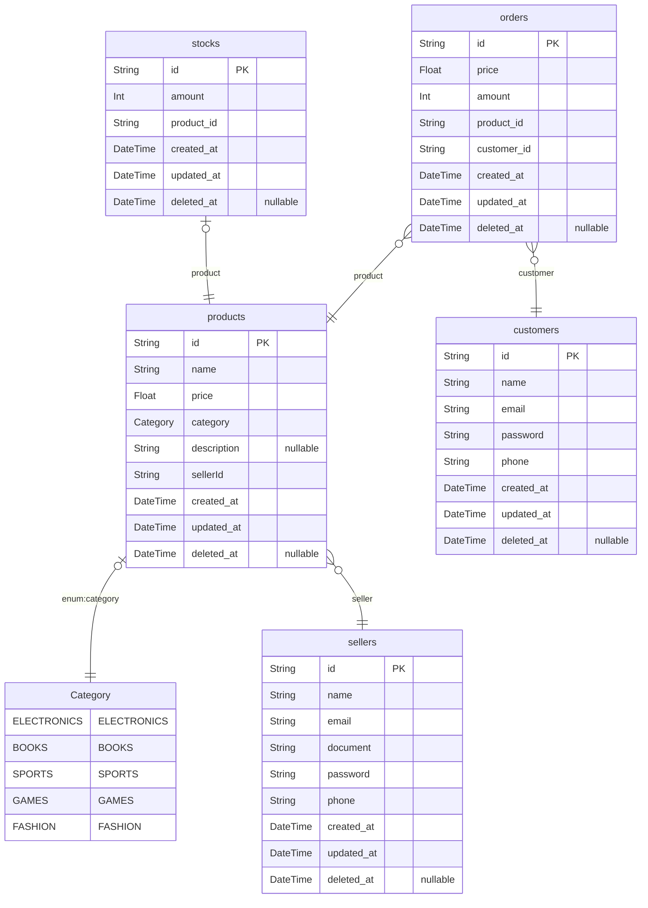

```mermaid
erDiagram

        Category {
            ELECTRONICS ELECTRONICS
BOOKS BOOKS
SPORTS SPORTS
GAMES GAMES
FASHION FASHION
        }
    
  customers {
    String id PK 
    String name  
    String email  
    String password  
    String phone  
    DateTime created_at  
    DateTime updated_at  
    DateTime deleted_at  "nullable"
    }
  

  sellers {
    String id PK 
    String name  
    String email  
    String document  
    String password  
    String phone  
    DateTime created_at  
    DateTime updated_at  
    DateTime deleted_at  "nullable"
    }
  

  products {
    String id PK 
    String name  
    Float price  
    Category category  
    String description  "nullable"
    String sellerId  
    DateTime created_at  
    DateTime updated_at  
    DateTime deleted_at  "nullable"
    }
  

  stocks {
    String id PK 
    Int amount  
    String product_id  
    DateTime created_at  
    DateTime updated_at  
    DateTime deleted_at  "nullable"
    }
  

  orders {
    String id PK 
    Float price  
    Int amount  
    String product_id  
    String customer_id  
    DateTime created_at  
    DateTime updated_at  
    DateTime deleted_at  "nullable"
    }
  
    products o|--|| Category : "enum:category"
    products o{--|| sellers : "seller"
    stocks o|--|| products : "product"
    orders o{--|| products : "product"
    orders o{--|| customers : "customer"
```
